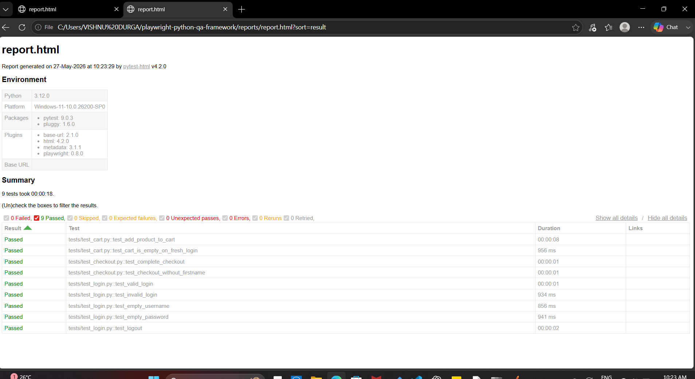

<h1 align="center">🎭 Playwright Python QA Framework</h1>

  End-to-end test automation framework built with Python, Playwright, and pytest
  using Page Object Model architecture on saucedemo.com

---

## 🛠️ Tech Stack

---

## 📌 What This Project Covers

- ✅ Page Object Model architecture
- ✅ pytest fixtures and conftest.py
- ✅ Cross-browser testing
- ✅ HTML test reports
- ✅ CI/CD with GitLab pipeline
- ✅ Positive and negative test scenarios

---

## 📁 Project Structure

playwright-python-qa-framework/
├── pages/
│   ├── base_page.py
│   ├── login_page.py
│   ├── inventory_page.py
│   ├── cart_page.py
│   └── checkout_page.py
├── tests/
│   ├── test_login.py
│   ├── test_cart.py
│   └── test_checkout.py
├── reports/
├── conftest.py
├── pytest.ini
└── .gitlab-ci.yml

---

## 🧪 Test Coverage

### Module 1 — Login Tests
| Test | Scenario | Result |
|---|---|---|
| test_valid_login | Login with correct credentials | ✅ Pass |
| test_invalid_login | Login with wrong credentials | ✅ Pass |
| test_empty_username | Login with empty username | ✅ Pass |
| test_empty_password | Login with empty password | ✅ Pass |
| test_logout | Logout and verify redirect | ✅ Pass |

### Module 2 — Cart Tests
| Test | Scenario | Result |
|---|---|---|
| test_add_product_to_cart | Add product and verify cart | ✅ Pass |
| test_cart_is_empty_on_fresh_login | Verify empty cart on login | ✅ Pass |

### Module 3 — Checkout Tests
| Test | Scenario | Result |
|---|---|---|
| test_complete_checkout | Full checkout flow end to end | ✅ Pass |
| test_checkout_without_firstname | Missing field validation | ✅ Pass |

---

## ▶️ How to Run

Install dependencies
pip install playwright pytest pytest-playwright pytest-html
playwright install

Run all tests
pytest

View Report
Open reports/report.html in browser after running tests

---

## 📊 Test Results

9 tests passing across 3 modules

---

## 📸 Sample Report

---

## 🔑 Key Concepts Used

- ✅ Page Object Model
- ✅ pytest fixtures — function and session scope
- ✅ conftest.py for shared setup
- ✅ Assertions with Playwright expect
- ✅ Cross-browser support
- ✅ GitLab CI pipeline integration

---

## 👩‍💻 Author

**Vishnu Durga S**
🔗 [GitHub](https://github.com/VishnuDurgaCse)
📧 vishnudurgacs@gmail.com
